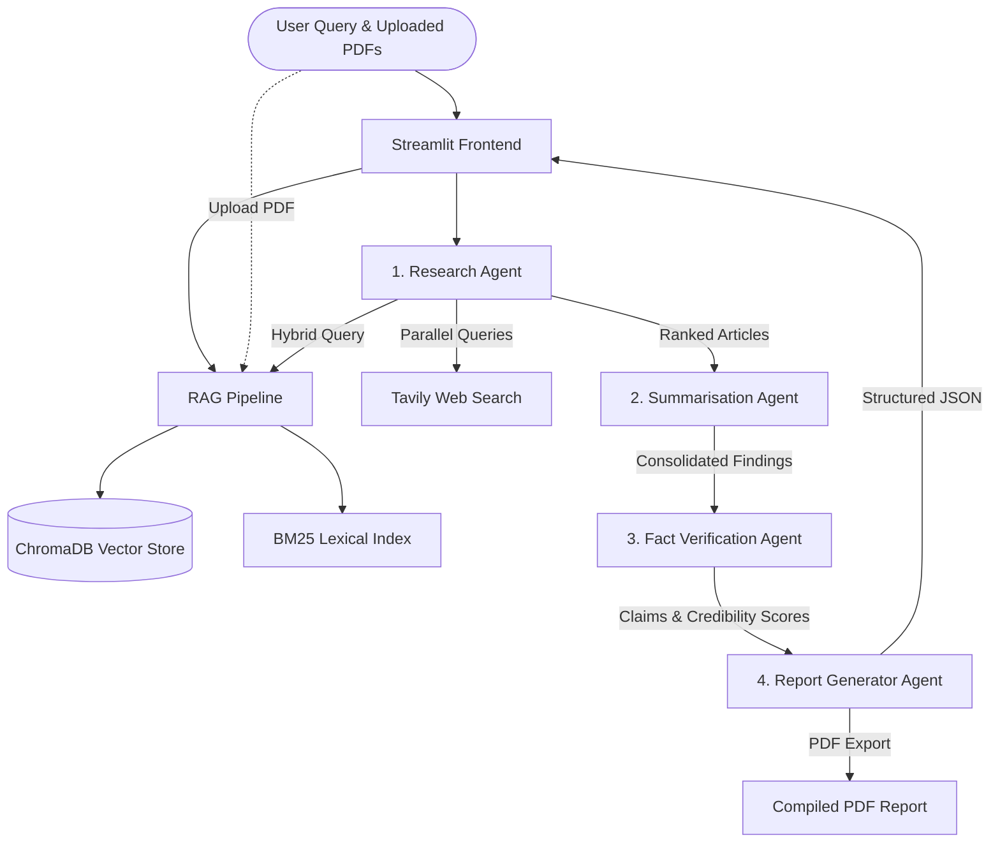

# Multi-Agent Research Assistant Documentation

Welcome to the **Multi-Agent Research Assistant** documentation. This project is a state-of-the-art research pipeline leveraging LLMs, hybrid RAG (Retrieval-Augmented Generation), and cooperative agent workflows to compile high-quality, fact-verified, and formatted research reports.

---

## 1. System Architecture Overview

The system is built on a modular architecture where specialised agents collaborate sequentially to ingest raw information, refine it into knowledge, verify the claims, and compile a cohesive academic-style report.



---

## 2. Core Components

### 2.1 Configuration Layer (`config.py`)
- **Purpose**: Centralizes system settings, environment variable loading, and API validation.
- **Environment Keys**:
  - `GROQ_API_KEY`: Powering the main LLM orchestration (`llama-3.3-70b-versatile`).
  - `TAVILY_API_KEY`: Powering external web search.
  - `LANGCHAIN_API_KEY`: (Optional) For LangChain tracing.
- **ChromaDB Config**: Supports multiple database persistence modes (`persistent`, `ephemeral`, `http`).

### 2.2 Async Client Utilities (`utils/clients.py`)
- **Robust Groq Generation (`groq_generate`)**: Automatically queries multiple Groq endpoints and resolves schema changes (OpenAI chat completion vs. older text generation formats) for maximum fault tolerance.
- **Tavily Integration (`tavily_search`)**: Orchestrates parallel external lookups and normalizes search snippet metadata.
- **PDF Extraction (`load_pdf_text`)**: Converts uploaded documents page-by-page into plain text using `PyPDF2` for indexing.

### 2.3 RAG Pipeline (`rag_pipeline.py`)
Features a state-of-the-art **Hybrid Retrieval Model** combining dense vector search and sparse keyword search:
1. **Dense Vector Search**: Powered by `chromadb` using `all-MiniLM-L6-v2` Sentence Transformer embeddings.
2. **Sparse Lexical Search**: Powered by `BM25Okapi` (`rank-bm25`).
3. **Hybrid Search Merger**: Reciprocal rank style scores combined to rank elements (60% weight to vector search, 40% to BM25 search).
4. **Isolated PDF Indexing**: Segregates local uploaded PDF content into a separate collection (`uploaded_pdfs`) to allow targeted referencing.

### 2.4 Multi-Agent Cooperative Engine (`agents/`)

#### 🕵️ Research Agent (`research_agent.py`)
- Executes parallel calls to Tavily search, ChromaDB vector collections, and uploaded document databases.
- Consolidates and normalizes results by score, removing duplicates.

#### 📝 Summarisation Agent (`summarisation_agent.py`)
- Splits retrieval lists into manageable batches (size=5) for async summarization.
- Merges partial summaries into a structured executive summary with transitions.

#### ✅ Fact Verification Agent (`verification_agent.py`)
- Extracts key factual statements from the summary using Groq.
- Assigns initial credibility/confidence scores.
- Automatically launches deep web checks (WHO and PubMed sources) for low-confidence statements to confirm veracity.

#### 🖨️ Report Generator (`report_generator.py`)
- Maps findings, summaries, and references to standard sections: *Abstract, Introduction, Literature Review, Findings, Conclusion, and References*.
- Exports formatted reports to PDF using `ReportLab` flowables.

---

## 3. Setup & Running

### Prerequisites
- Python 3.10+
- Groq API Key and Tavily API Key

### Installation

1. **Clone the repository and enter the directory**:
   ```bash
   cd MultiAgentProject
   ```

2. **Initialize Python environment**:
   ```bash
   python -m venv .venv
   # Windows Activation:
   .\.venv\Scripts\Activate.ps1
   # macOS/Linux Activation:
   source .venv/bin/activate
   ```

3. **Install dependency packages**:
   ```bash
   pip install -r requirements.txt
   ```

4. **Environment Setup**:
   Create a `.env` file from the example template:
   ```bash
   copy .env.example .env
   ```
   Add your keys:
   ```env
   GROQ_API_KEY=gsk_...
   TAVILY_API_KEY=tvly_...
   ```

5. **Start Streamlit Frontend**:
   ```bash
   streamlit run streamlit_app.py
   ```

---

## 4. Custom Streamlit Interface Overview

The UI is built with a responsive layout designed for scientific research workflows:
- **Research Scope Control**: Enables toggle controls for search depth and source configuration.
- **Dynamic Workspaces**: Displays live agent status, execution logs, and step progress.
- **Embedded Document Viewer**: Renders the complete multi-section report directly on the main page.
- **Multi-Format Export**: One-click downloads for PDF, DOCX, Markdown, and TXT formats.
